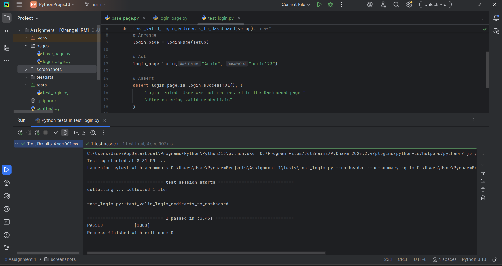
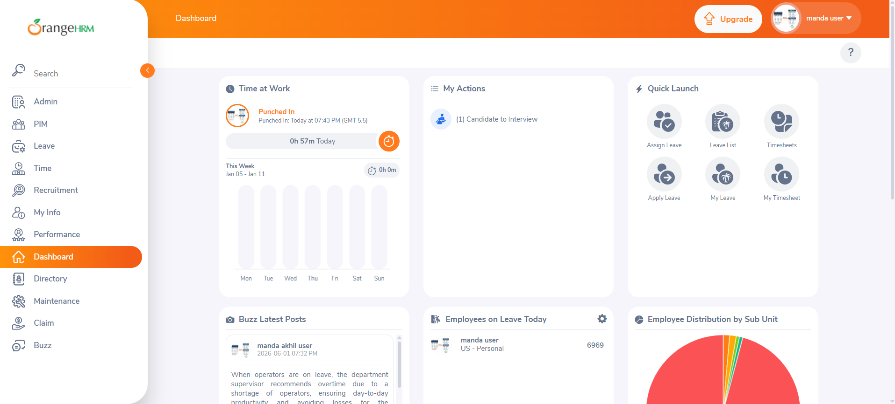

# 🚀 OrangeHRM Login Automation  
**AI-Assisted Selenium PyTest Framework**


---

## 📌 Project Overview

This repository contains an **AI-assisted test design and automation framework** built using **Selenium WebDriver, PyTest, and the Page Object Model (POM)**.

The project was created as part of a technical assessment to demonstrate:

- Practical QA automation skills  
- Clean and scalable framework design  
- Responsible and thoughtful use of AI in test case design  

AI was used to support **test design and analytical thinking**, while all final test cases and automation decisions were **manually reviewed and validated** following industry QA best practices.

---

## 🌐 Application Under Test

**OrangeHRM Demo Application**  
🔗 https://opensource-demo.orangehrmlive.com/

---

## 🤖 AI-Generated Functional Test Cases (Login Module)

AI was used as a **test design assistant** to generate and refine high-impact functional test scenarios for the Login module.  
All generated scenarios were reviewed, optimized, and finalized manually.

### Finalized Test Scenarios

**Test Case 1 – Valid Login (Automated)**  
Verify successful login using valid credentials  
**Expected Result:** User is redirected to the Dashboard  

**Test Case 2 – Invalid Password**  
Valid username with incorrect password  
**Expected Result:** Error message *“Invalid credentials”*  

**Test Case 3 – Empty Fields Validation**  
Attempt login with empty username and password  
**Expected Result:** Required field validation messages displayed  

**Test Case 4 – Input with Leading/Trailing Spaces**  
Username entered with extra spaces  
**Expected Result:** System trims spaces and allows login  

**Test Case 5 – Keyboard Interaction**  
Login using the **Enter key** instead of clicking the Login button  
**Expected Result:** Successful login  

📄 **Detailed test cases are documented in the Excel file included in the repository.**

---

## 🧠 How AI Helped Test Design

AI was used thoughtfully to enhance test design quality, not to replace manual QA judgment.

AI helped to:
- Identify both **positive and negative authentication scenarios**
- Consider **real user behavior** (keyboard usage, input formatting)
- Reduce redundant scenarios and focus on **high-impact coverage**
- Improve clarity of test steps and expected results

All AI-generated suggestions were **reviewed, refined, and validated manually**, ensuring alignment with real-world QA and automation best practices.

---

## 🧪 Automated Test Case

### Automated Scenario
**TC_LGN_01 – Verify successful login with valid credentials**

This test case was selected for automation because:
- It represents a **core business-critical user flow**
- It is **stable and suitable for UI automation**
- It clearly demonstrates **framework design, synchronization, and POM usage**

Negative scenarios were intentionally **not automated** to avoid UI flakiness and to maintain test stability, following real-world automation strategy.

---

## 🛠️ Tech Stack Used

- Python 3.13  
- Selenium WebDriver  
- PyTest  
- WebDriver Manager  
- Page Object Model (POM)  

---

## 📂 Project Structure

```
Assignment 1 [OrangeHRM]
│
├── pages/
│   ├── base_page.py        # Reusable Selenium actions & explicit waits
│   └── login_page.py       # Login page object
│
├── testdata/
│   └── OrangeHRM_Login_TestCases.xlsx  
│
├── tests/
│   └── test_login.py       
│
├── screenshots/            
│
├── .gitignore              
├── conftest.py             
├── pytest.ini              
├── requirements.txt        
└── README.md
```


---


## ⚙️ Framework Highlights
* Clean Page Object Model
* Centralized BasePage for reusable actions
* Explicit waits for dynamic SPA behavior
* No hard-coded sleeps
* Maintainable and scalable design
* Easy to extend for additional test cases


---


## ▶ Execution Steps

1. Clone the repository
2. Navigate to the project directory
3. Install dependencies:
       ```bash 
        pip install -r requirements.txt 
        pytest

---

## 🖼️ Screenshots

The following screenshots demonstrate successful execution of the automated login test and application behavior.

### ✅ PyTest Execution Result
This screenshot shows the successful execution of the automated test case (`TC_LGN_01`) using PyTest.



---

### ✅ Successful Login – Dashboard Page
This screenshot confirms that the user is redirected to the Dashboard page after successful login with valid credentials.



---

## 🎯 What This Assignment Demonstrates

- Strong understanding of **manual and automation testing concepts**
- Practical experience with **Selenium and PyTest**
- Clean automation framework design using **POM**
- Responsible and effective use of **AI in QA workflows**
- Focus on **maintainability, stability, and real-world practices**

---

